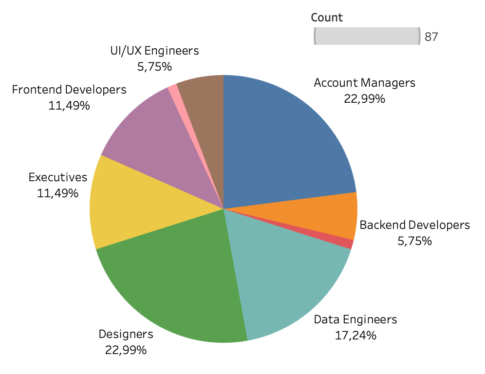
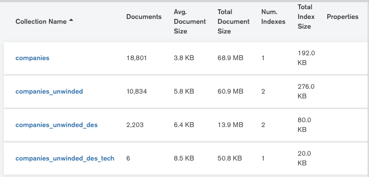
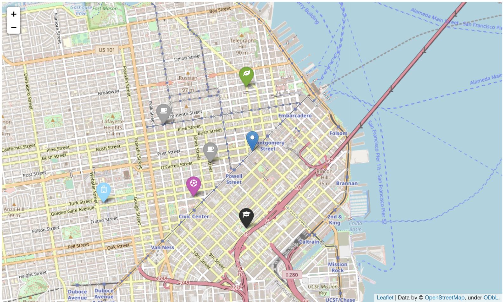

# Find the perfect location for your company
## Ironhack's Data Analytics Bootcamp Project nº IV: GeoSpatial Data Project with MongoDB


The **main goal** of this analysis project is to find the optimal location for a company wuth the following structure:
- 20 Designers
- 5 UI/UX Engineers
- 10 Frontend Developers
- 15 Data Engineers
- 5 Backend Developers
- 20 Account Managers
- 1 Maintenance guy that loves basketball
- 10 Executives
- 1 CEO/President


I was given a certain number of requirements:
- Designers like to go to design talks and share knowledge. There must be some nearby companies that also do design.
- 30% of the company have at least 1 child.
- Developers like to be near successful tech startups that have raised at least 1 Million dollars.
- Executives like Starbucks A LOT. Ensure there's a starbucks not to far.
- Account managers need to travel a lot
- All people in the company have between 25 and 40 years, give them some place to go to party.
- The CEO is Vegan
- If you want to make the maintenance guy happy, a basketball stadium must be around 10 Km.
- The office dog "Pepe" needs a hairdresser every month. Ensure there's one not too far away.

It is important to keep in mind that it is **not** possible to meet all the requirements. So which ones should I meet and which ones should I leave out?

Before exploring and filtering the dataset, I have given a **priority** to each requirement based on the level of importance and impact it has on our company. To do so, I have calculated the total number of employees and from that, I have extracted the percentage that each **department** represents.



This way, I  know which one is more important and how I can to prioritize the list of requirements. The result is the following:
- **#1**: Designers like to go to design talks and share knowledge. There must be some nearby companies that also do design.
- **#1**: Developers like to be near successful tech startups that have raised at least 1 Million dollars.
- **#2**: 30% of the company have at least 1 child.
- **#2**: Account managers need to travel a lot
- **#3**: Executives like Starbucks A LOT. Ensure there's a starbucks not to far.
- **#3**: All people in the company have between 25 and 40 years, give them some place to go to party.
- **#3**: The CEO is Vegan
- **#4**: If you want to make the maintenance guy happy, a basketball stadium must be around 10 Km.
- **#4**: The office dog "Pepe" needs a hairdresser every month. Ensure there's one not too far away.

-----
## First, we explore & filter
To begin with, I sourced our dataset ``companies.json()`` from [Crunchbase](https://www.crunchbase.com/). It was a pretty vast database with a lot of information, so the first thing I did before jumping into choosing the optimal location was to check how many companies had both latitude and longitude (simply because I could not choose a company with null coordinates). I also checked how many different categories were.

Then, I proceeded to ``$unwind`` the offices since I needed a list with all the different office locations in a single MongoDB collection. I used the "aggregate" and "insert_many" methods and named the collection: *companies_unwinded*.

Once that was done, I decided to jump into the first filter: being close to a **design company**. To do so, I entered a query with a filter and got back 4 results, meaning that there were 4 places that were devoted to Design. These were: San Francisco, Collingwood, Berlin and Ellensburg.

Moving on, I made use of the operator ``$near`` to check how many companies from the subset were close to those 4 locations. I created a geoIndex, which was definitely challenging, and through a geoJSON I got a list, which I then inserted into MongoDB as another collection: *companies_unwinded_des*.

I filtered again to extract the companies that were close to **tech startups that raised more than $ 1 million**. I created another collection in MongoDB, *companies_unwinded_des_tech* and my reaming options were 6.

RECAP from the first part: I went from having a database with 18,801 collections to a dataset with 6. It is much easier to move on now to the next step: finding information with APIs.



----
## Second, we find information with APIs
In this step I used the [FourSquare API](https://developer.foursquare.com/) to get the coordinates of specific places.

The 3rd filter I introduced was **airports**. Since the company has 20 Account managers and they need to travel a lot, I thought it was pretty important. I first authenticated my credentials (id and secret id) and then wrote a query to find out the closest airport to the 6 locations. The result was San Francisco International Airport (SFO). I then used ``Folium`` to represent the locations in a map and that way, discard the locations that were the furthest from SFO, which were TRIRIGA and SolarEdge.

The 4th filter is finding **party venues**. For this requirement, I went for Jazz clubs, since hey, why not (Jazz is cool right?). Okay, so I found out that eMeter was too far away, so I discard it.

The 5th filter is finding a **Vegan restaurant** nearby. Since the CEO of the company is vegan, I want to make him happy. I find two locations, which is great.

The 6th filter is finding a **Basketball Court** because the maintenance guy likes it, and he is an asset for the company. I discard CatalystBiosciences.

Last but not least, the 7th and last filter is looking for a **School**. This filter was not really necessary, but since I was debating between 2 companies that were very close to each other, I decided to check another requirement. I went for the PreSchool category since the employees are aged between 25 and 40 years old, and intuitively I have concluded that they have young children. As a result, I discarded GreenVolts and went for Sunrun as my perfect location for our Gaming company.

```python
name: Sunrun
address: 45 Fremont Street, 32nd Floor, San Francisco CA, 94105, USA
latitude: latitude: 37.7871306
longitude: -122.4041075
```


----
## Challenges
In my opinion, this project hasn't been easy by no means. Some of the challenges I have encountered along the way are:
- Creating a geoIndex. It was as simple as making sure that the iterator "res" was correctly executed, however, this step has taken up most of my time to do this project, which is why I haven't been able to do everything I had envisioned. 
- Changing my mindset into a "matryoshka dolls mindset". Meaning that after applying one filter, I had to save the collection into MongoDB and keep applying filters into that new collection. That way, my options narrowed and I could start using APIs.


- Time constraint. 
- Using functions and for loops.
- The biggest challenge by far for me has been the mental one. I have been fighting my thoughts of giving up and leaving the project unfinished many times throughout the weekend. However, even though it still has a lot of improvement to do, I am happy and satisfied with myself for the mental effort I have done. 

---
## Future Improvements
Even though I have met the requirements for this project, there are many improvements that can be done. For instance, the first that comes to mind is creating functional programming to make the code more efficient and structured. Next time by using functions and the "apply" method I can be more productive and my code will look "prettier".


Link to my Tableau profile:
https://public.tableau.com/profile/angela.gomez4298#!/vizhome/Companies_16055711352000/Companies?publish=yes


